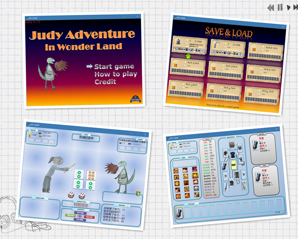

# Tower-of-Fortune

An RPG game with a Diablo-like equipment system, written in Python with Cocos2d
The Tower of fortune pays homage to the following great games:
- Tower of fortune (iOS)
- The Diablo series
- The Gambling God (FC)

Now the game is playable.

## Game features:
- six zones
- 180 different enemies with unique sprites
- 27 types for every kind of enemy
- Normal, Elite, Little Boss and Boss types of enemies
- random item with many affixes , over 20 types , four rarity type (Normal, Magic, Rare, Legend)
- 15 kinds of skills for the player, 7 for the enemies
- player can level up to 60
- save and load games
- the player dies! (Rogue-like) , the body can be looted

## to do list

### [mist]
- try the GitHub Pages
- ~~menu GUI fix~~ (done)
- ~~rewrite(or remove) the show_message~~ (done)
- add the credit layer
- ~~add a more attractive screenshot~~ (done)
- ~~add all the sprite image of the enemies~~ (98% completed, the left are waiting for Judy's painting )
- merge all the image files into a single zip file
- add music
- add how-to-play layer

### [main_scr]
- ~~change the ARROW-CONTROL ICONS to sprites, so we can see different indications for different events (battle, tent, corpse)~~ (done)
- ~~minor fix of the above icon for corpse events (scale and indications)~~
- ~~waiting for the world-map sprites drawn by Judy~~( done, used a map from ArtStation)
- ~~add different backgroud image for different zones~~ (done)

### [game]
- ~~every monster can be drawn with its sprite image separately  from a ZIP file~~ (GREAT!!) (DONE)
- add the event of CAMP (enchanting the item and healing the player) (partly done, enchanting is not done, for lacking GUI-solution)
- ~~add the event of the corpse (reclaim all the items equipped in the dead player)~~ (event added, but the price is not decided yet)
- ~~the player can go to more zones when level-up~~ (done)

### [save_load_layer]
- ~~delete save slot~~ (done)
- ~~add message box for confirmation~~ (done)
- ~~gui(selected message box) for delete and enter the game~~ (done)
- ~~set the location of the message box~~ (done)

### [skill]
- ~~the quantity of the player's skills increases when leveling up~~ (done)
- ~~the display logic and GUI of skills(in info_layer) need to be fix~~ (done)

### [battle]
- add hp change effect (Green color text going up) for the player when hp-regen(absorb) occurs
- the color of the enemy's name text varies depending on the rank
- fix the enemy's name when moves to the camp event and corpse event
- skill effect(sprites) 

### [item]
- ~~the affix: Hp_Absorb need to be fixed~~ (done)
