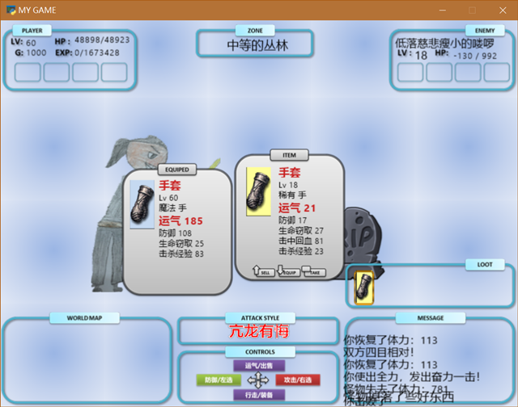

# Tower-of-Fortune
a rpg game with a diablo-like equipment system.
The Tower of fortune pays homage to the following great games:
- Tower of fortune (iOS)
- The Diablo series
- The Gambling God (FC)

Now game is playable.

## to do list

### [mist]
- try the GitHub Pages
- ~~menu gui fix~~ (done)
- rewrite(or remove) the show_message
- add the credit layer

### [main_scr]
- change the ARROW-CONTROL ICONS to sprites, so we can see different indications for different events (battle, tent, corpse)

### [game]
- add the event of TENT (enchanting the item and healing the player)
- add the event of crop (reclaim the gold and all the items, including the ones in the item box and equiped, of the dead player) 

### [save_load_layer]
- delete save slot
- add message box for confirmation
- gui(selected message box) for delete and enter the game

### [skill]
- the qualtity of the player's skills increases when level up
- the display logic and GUI of skills(in info_layer) need to be fix

### [battle]
- add hp change effect (Green color text going up)for hp-regen(absorb) for the player
- skill effect(sprites) 

